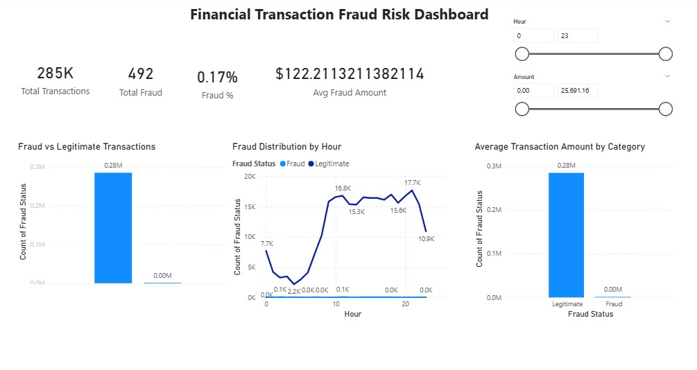

# 📊 Fraud Risk Analysis for Financial Transactions

## 🔎 Project Overview

Financial institutions face significant financial and reputational risks due to fraudulent transactions.  
This project performs an in-depth analysis of real-world transactional data to identify fraud patterns, understand behavioral anomalies, and propose strategic risk mitigation recommendations.

The objective is not just technical analysis, but business-driven insight generation aligned with consulting standards.

---

## 🎯 Business Objective

- Identify patterns associated with fraudulent transactions
- Analyze class imbalance challenges in fraud detection
- Extract actionable business insights
- Design a professional risk monitoring dashboard
- Provide strategic fraud mitigation recommendations

---

## 📂 Dataset Details

- **Total Transactions:** 284,807  
- **Fraudulent Transactions:** 492  
- **Fraud Rate:** 0.17%  
- **Source:** Kaggle – Credit Card Fraud Detection Dataset  
- **Features:**  
  - PCA-transformed variables (V1–V28)  
  - Transaction Time  
  - Transaction Amount  
  - Binary Fraud Label (Class)

This dataset represents highly imbalanced real-world financial transaction data.

---

## ⚙️ Tools & Technologies Used

- **Python**
  - Pandas
  - NumPy
  - Matplotlib
  - Seaborn
- **Power BI**
  - KPI Cards
  - Interactive Slicers
  - Fraud Monitoring Dashboard
- Data Cleaning & Exploratory Data Analysis
- Business Insight Generation

---

## 🔍 Exploratory Data Analysis (EDA)

### 1️⃣ Fraud Distribution
- Fraud cases represent only 0.17% of total transactions.
- Severe class imbalance creates challenges for detection accuracy.

### 2️⃣ Transaction Amount Analysis
- Fraud transactions show higher variability in amounts.
- Irregular transaction patterns suggest anomaly-based detection suitability.

### 3️⃣ Time-Based Analysis
- Fraud clustering observed during specific hourly intervals.
- Indicates potential monitoring gap periods.

### 4️⃣ Correlation Insights
- Certain PCA features show stronger correlation with fraud.
- Hidden behavioral patterns exist in anonymized components.

---

## 📈 Power BI Dashboard

The dashboard was designed using a consulting-style minimal layout.

### Dashboard Features:
- Total Transactions KPI
- Total Fraud Cases KPI
- Fraud Rate %
- Average Fraud Amount
- Fraud vs Legitimate Comparison
- Hourly Fraud Trend Analysis
- Interactive Hour & Amount Filters

### 📷 Dashboard Preview



---

## 💡 Key Business Insights

- Extreme class imbalance (0.17%) requires specialized detection strategies.
- Fraud transactions demonstrate anomaly-driven behavior rather than predictable patterns.
- Time clustering suggests operational monitoring improvements.
- Transaction amount variance indicates irregular fraud execution methods.

---

## 🧠 Strategic Business Recommendations

1. Deploy anomaly detection models instead of traditional rule-only systems.
2. Implement risk-based authentication for high-risk transactions.
3. Introduce real-time fraud monitoring dashboards.
4. Conduct cost-benefit analysis to optimize false positive trade-offs.
5. Continuously monitor fraud pattern shifts using adaptive analytics.

---

## 🏢 Consulting Perspective

If engaged as a risk analytics consultant, I would recommend implementing a hybrid fraud detection framework combining machine learning–based anomaly detection with rule-based risk scoring.

Additionally, I would develop a cost-optimization model to balance fraud prevention effectiveness with customer experience and operational efficiency.

---

## 📁 Project Structure

```
Fraud_Risk_Analysis/
│
├── notebook/
│   └── fraud_analysis.ipynb
│
├── report/
│   └── Fraud Risk Analysis for Financial Transactions.pdf
│
├── images/
│   └── dashboard.jpeg
│
└── README.md
```

---

## 📌 Author

**Aayushi Jaiswal**  
BTech – Information Science & Engineering  
Aspiring Data Analyst | Interested in Financial Risk Analytics & Business Intelligence  

---

## 🚀 Future Improvements

- Implement ML-based fraud prediction model
- Add precision-recall evaluation
- Deploy dashboard to Power BI Service
- Integrate automated anomaly alert system

---

⭐ If you found this project insightful, feel free to connect or provide feedback!
